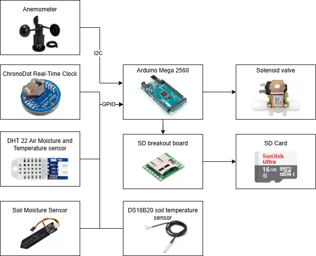

# What This is
To collect the data I needed for my [Soil Moisture ML](https://github.com/MoodyMarshmallow/Soil-Moisture-ML) project, I made a sensor array that could sit outside for a long time to collect environmental data with a high temporal resolution.
# How The Sensor Array Works
An Arduino takes the readings from various sensors and stores them in a CSV format on an SD card along with a Unix timestamp. The Arduino also randomly switches the sprinkler on and off, recording the state of the sprinkler on the SD card as well.
  

# The problems I faced
Once I finished making the initial design of the array, it took several days of on-site troubleshooting for me to get the sensor array to record accurately and reliably. The biggest issue I faced was stopping a leak at the connection point between the water supply pipe for the sprinkler and the solenoid valve that controlled the sprinkler. To seal the leak, I ended up trying several connectors before finding one that could handle the water pressure.
